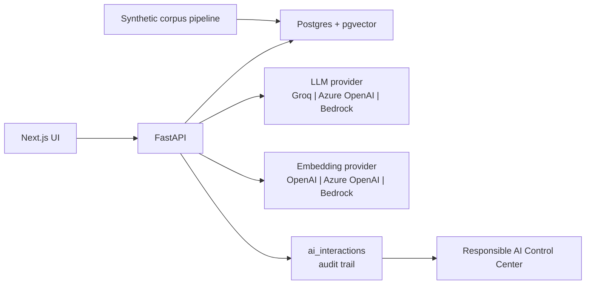

# Scribe IQ

**Responsible clinical AI platform prototype** for grounded, auditable documentation workflows on synthetic data.

Scribe IQ is a full-stack clinical documentation and retrieval system built on a synthetic patient corpus. It demonstrates grounding LLM responses in stored clinical context, generating structured clinical notes from transcripts, and making AI interactions auditable from day one.

Built on synthetic data. Not for clinical decision-making.

Start with the product case study: [`docs/overview/PORTFOLIO_CASE_STUDY.md`](docs/overview/PORTFOLIO_CASE_STUDY.md).

The system has been built incrementally; documentation is maintained alongside the code. The index below is the canonical entry point.

---

## Why this project matters

- Bridges higher-education experience with sensitive advising notes, student success workflows, enterprise data platforms, RAG, and responsible AI governance into a healthcare-shaped product setting.
- Demonstrates clinical AI reliability patterns: grounded retrieval, citations, structured note generation, source traceability, prompt/model audit, degraded modes, and explicit provider boundaries.
- Shows platform architecture across data, service, AI, UI, and governance layers rather than a narrow chatbot demo.
- Supports institution-aligned deployment thinking: Groq for low-friction synthetic demos; Azure OpenAI and Amazon Bedrock for enterprise cloud paths.

---

## Product lens

Scribe IQ is framed as a clinical documentation product prototype, not just a technical demo:

- Turns a synthetic longitudinal chart into usable clinician-facing workflows.
- Makes degraded states explicit when providers, embeddings, or feature flags are unavailable.
- Treats provider boundaries, auditability, and production caveats as product requirements.
- Keeps the offline corpus pipeline separate from request-time user experience.

---

## Product and platform highlights

| Signal | Evidence |
|--------|----------|
| Product thinking | Patient chart, encounter viewer, pre-meeting prep, structured note generation, Responsible AI Control Center |
| AI engineering | Grounded RAG with citations, prompt contracts, JSON note generation, provider-agnostic LLM layer |
| Data/platform architecture | Offline corpus pipeline, Postgres/pgvector, Alembic migrations, health/readiness flags, embedding provider abstraction |
| Responsible AI | Append-only `ai_interactions`, redacted previews, prompt/model traceability, safety heuristics, source traces |
| Healthcare relevance | Synthetic clinical corpus, PHI/provider boundary docs, production caveats for real healthcare deployment |
| Engineering discipline | FastAPI, Next.js, tests, CI, migrations, typed API client, structured logging |

---

## Where to go next

| If you want to | Open |
|----------------|------|
| Start with the product case study | [`docs/overview/PORTFOLIO_CASE_STUDY.md`](docs/overview/PORTFOLIO_CASE_STUDY.md) |
| Understand privacy/provider boundaries | [`docs/overview/PRIVACY_AND_PROVIDER_BOUNDARIES.md`](docs/overview/PRIVACY_AND_PROVIDER_BOUNDARIES.md) |
| Understand the architecture (diagrams, flags, seams) | [`docs/overview/SYSTEM_OVERVIEW.md`](docs/overview/SYSTEM_OVERVIEW.md) |
| Understand the product framing and scope | [`docs/overview/PRODUCT_CONTEXT.md`](docs/overview/PRODUCT_CONTEXT.md) |
| Run the system locally | [`docs/guides/QUICKSTART.md`](docs/guides/QUICKSTART.md) |
| Read rationale and alternatives considered | [`docs/overview/DESIGN_NOTES.md`](docs/overview/DESIGN_NOTES.md) |
| Inspect the as-built API and schema | [`docs/architecture/IMPLEMENTED_BASELINE.md`](docs/architecture/IMPLEMENTED_BASELINE.md) |
| See the full documentation map | [`docs/README.md`](docs/README.md) |

---

## Stack

| Layer | Technology |
|-------|------------|
| Frontend | Next.js (App Router), TypeScript |
| Backend | FastAPI, asyncpg, Pydantic |
| Data store | Postgres 16 with pgvector |
| LLM | Groq, Azure OpenAI, or Amazon Bedrock |
| Embeddings | OpenAI, Azure OpenAI, or Amazon Bedrock |
| Migrations | Alembic |
| Corpus pipeline | Python, Synthea, Hugging Face datasets, Groq |

---

## System at a glance



---

## What each key unlocks

Every external dependency is optional. The system degrades gracefully and reports what is configured via `GET /health`.

| Without any keys | LLM provider credentials | Embedding provider credentials + `--embed` | Admin flags |
|------------------|--------------------------|--------------------------------------------|-------------|
| Patient list, charts, encounter viewer | Pre-meeting summaries, structured note generation | RAG chat with citations | Responsible AI Control Center |

For the full flag matrix, see [`docs/overview/SYSTEM_OVERVIEW.md`](docs/overview/SYSTEM_OVERVIEW.md#capability-flags).

---

## Screenshots

The UI is backed by a synthetic Synthea cohort; on-screen labels make this explicit.

### Patient list


### Patient chart


### Pre-meeting summary


### Encounter viewer


### Responsible AI


---

## Architecture themes (short)

**Vectors in Postgres** · **Provider-agnostic LLM/embedding layer** · **Retrieval-first chat with citation syntax** · **Append-only `ai_interactions` on AI routes**. Diagrams, flags, and extension table: [`docs/overview/SYSTEM_OVERVIEW.md`](docs/overview/SYSTEM_OVERVIEW.md). Rationale and alternatives: [`docs/overview/DESIGN_NOTES.md`](docs/overview/DESIGN_NOTES.md).

---

## Product case study

Product narrative — problem, workflows, architecture, governance boundaries, decisions, outcomes, and production limits: [`docs/overview/PORTFOLIO_CASE_STUDY.md`](docs/overview/PORTFOLIO_CASE_STUDY.md).

---

## Quick start

The pre-built corpus under `data/clinical_corpus_v2/` is loaded into Postgres in one command. Full prerequisites, optional capability paths, and troubleshooting: [`docs/guides/QUICKSTART.md`](docs/guides/QUICKSTART.md).

```bash
docker compose up -d
cd backend && python -m venv .venv && source .venv/bin/activate && pip install -e .
alembic upgrade head
scribe-load-corpus
uvicorn app.main:app --reload --host 127.0.0.1 --port 8000
# in a second terminal
cd frontend && nvm use && npm install && npm run dev
```

Frontend: <http://localhost:3000>. Backend: <http://127.0.0.1:8000/health>.
