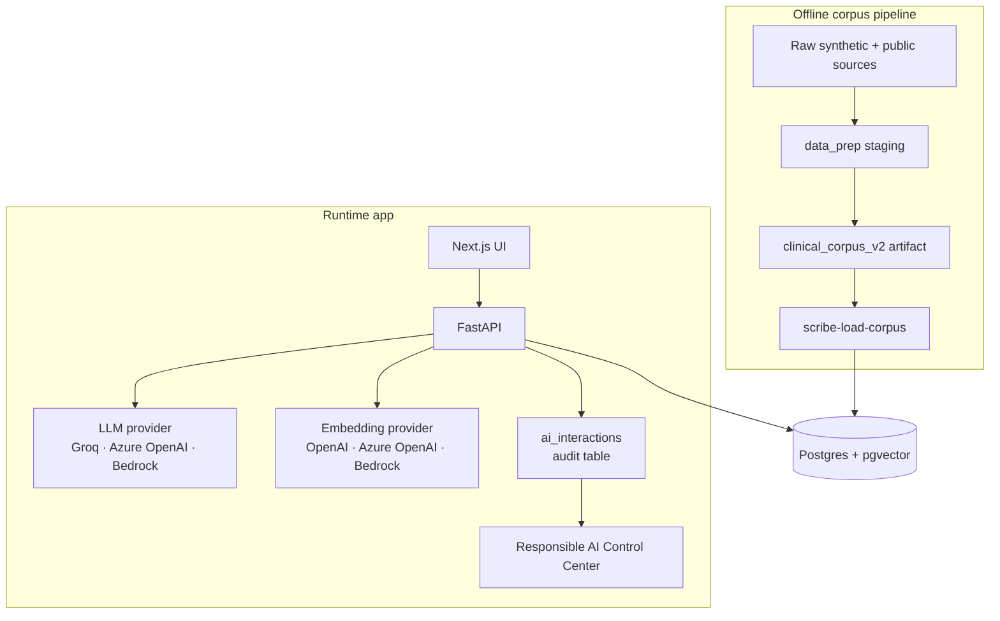
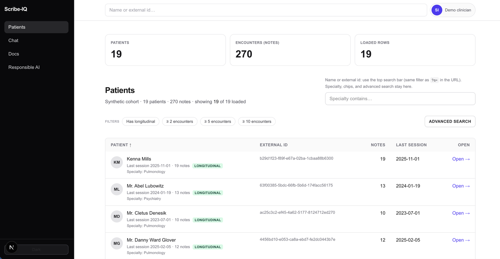
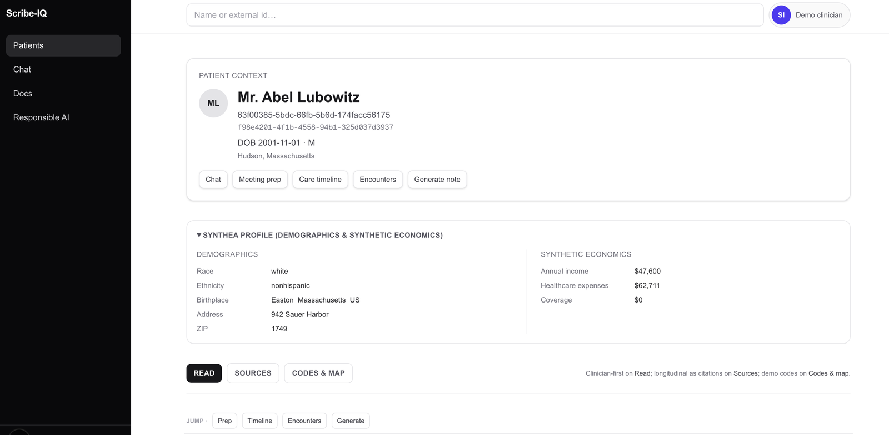
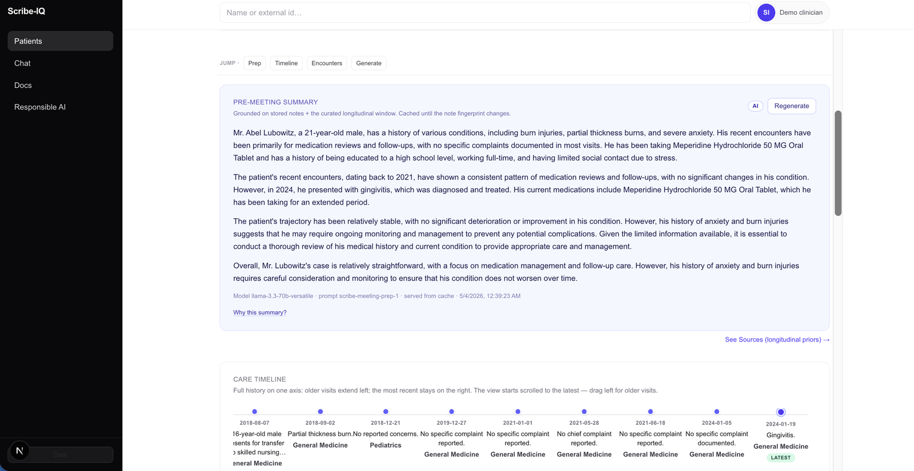
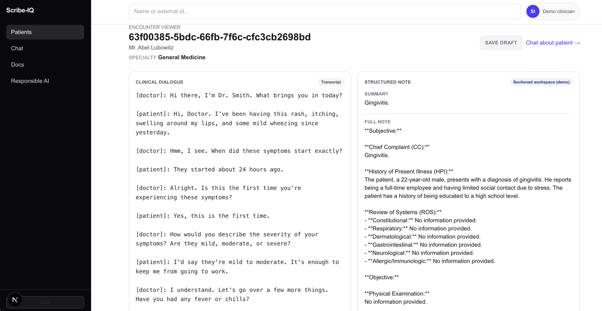
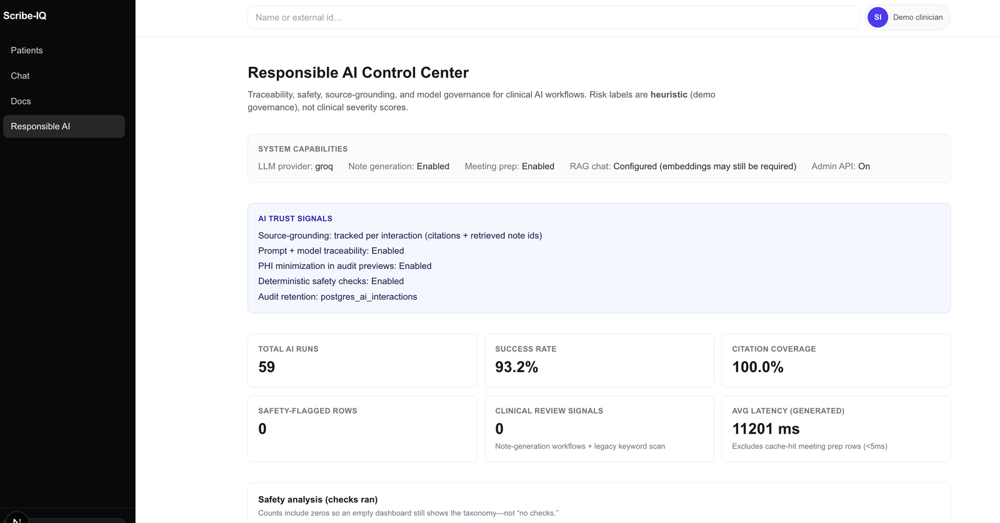

# Scribe IQ

[](https://github.com/sandeep-jay/scribe-iq/actions/workflows/ci.yml)
[](LICENSE)

**Grounded clinical documentation AI prototype** built on a synthetic Synthea patient spine, public clinical note corpora, RAG, pgvector, FastAPI, Next.js, and governed LLM audit workflows.

Scribe IQ is built around a product premise: clinical AI is only useful if it is grounded in the patient record, clear about its limits, and auditable when it influences human work.

The project demonstrates how an offline synthetic clinical corpus becomes a governed AI product: corpus construction, Postgres/pgvector serving, provider-agnostic LLM workflows, clinical documentation UI, and Responsible AI auditability.

Built on synthetic data. Not for clinical decision-making.

---

## Product framing

Scribe IQ is not a chatbot wrapped around clinical notes. It is a clinical documentation product prototype shaped around the constraints healthcare AI has to respect:

- **Grounding:** answers and summaries should trace back to stored notes and encounters.
- **Workflow fit:** AI features live inside chart review, encounter viewing, pre-meeting prep, and note drafting.
- **Governance:** AI interactions are recorded as first-class audit rows, not loose logs.
- **Degraded states:** missing providers, embeddings, and feature flags are surfaced explicitly.
- **Boundary discipline:** synthetic data only; PHI readiness, SSO, tenancy, and BAA-backed deployment are named production seams.

I built Scribe IQ to make the bridge from education data platforms to healthcare AI concrete. My background is in governed education systems: longitudinal student records, sensitive advising notes, privacy-aware analytics, and human decision support. Scribe IQ translates the same architecture into a healthcare-shaped system: longitudinal patient records, clinical notes, retrieval-grounded AI, human review boundaries, and governance as schema.

---

## What this shows

| Layer | What is demonstrated |
|-------|----------------------|
| Corpus / data product | Nine-step offline `data_prep/` pipeline over Synthea and public clinical note sources; generated corpus artifact with manifest, dataset card, validation checks, and audit report |
| Serving substrate | FastAPI, Postgres/pgvector, Alembic migrations, async database access, and one governed store for patient rows, notes, embeddings, and audit records |
| Clinical workflows | Patient chart, encounter viewer, care timeline, pre-meeting prep, structured note generation, and grounded RAG chat |
| Responsible AI | Citation contract, append-only `ai_interactions`, redacted previews, prompt/model traceability, source traces, and Responsible AI Control Center |
| Production judgment | Explicit synthetic-data boundary, provider egress caveats, degraded states, and named seams for SSO, tenant isolation, PHI controls, and observability |

---

## Corpus

I generated a synthetic longitudinal patient and encounter corpus for Scribe IQ — no real PHI — by leveraging these open sources:

- **[Synthea](https://github.com/synthetichealth/synthea)** — synthetic patient spine: demographics, encounters, conditions, medications, observations, and longitudinal structure.
- **[MTSamples](https://huggingface.co/datasets/harishnair04/mtsamples)** — public outpatient-style clinical note examples.
- **[MedSynth](https://huggingface.co/datasets/Ahmad0067/MedSynth)** — synthetic SOAP-style clinical notes and dialogue/note pairs.
- **[ACI-Bench](https://huggingface.co/datasets/mkieffer/ACI-Bench)** — encounter dialogue examples used in showcase workflows.

`data_prep/` matches public note examples to Synthea encounters, scores candidate fit, adapts notes for patient-level consistency, validates outputs, and emits `clinical_corpus_v2/` with a manifest, dataset card, and audit report.

Synthetic data only. No real PHI is used. The system is for demonstration and architecture review, not clinical decision-making.

---

## Architecture

`data_prep/` → `clinical_corpus_v2/` artifact → `scribe-load-corpus` → Postgres/pgvector → FastAPI → Next.js → `ai_interactions` audit table.



---

## Start here

| Visitor | Best entry point |
|---------|------------------|
| New here | [`docs/overview/REVIEWER_GUIDE.md`](docs/overview/REVIEWER_GUIDE.md) |
| Product / architecture reviewer | [`docs/overview/PORTFOLIO_CASE_STUDY.md`](docs/overview/PORTFOLIO_CASE_STUDY.md) |
| Technical reviewer | [`docs/overview/SYSTEM_OVERVIEW.md`](docs/overview/SYSTEM_OVERVIEW.md) |
| Data platform reviewer | [`docs/guides/CORPUS_ARTIFACTS.md`](docs/guides/CORPUS_ARTIFACTS.md) |
| Local setup | [`docs/guides/QUICKSTART.md`](docs/guides/QUICKSTART.md) |
| Full docs | [`docs/README.md`](docs/README.md) |

---

## Screenshots

The UI is backed by a synthetic Synthea cohort; on-screen labels make this explicit.

### Patient list



### Patient chart



### Pre-meeting summary



### Encounter viewer



### Responsible AI



---

## Demo readiness

| Area | Status |
|------|--------|
| Synthetic clinical corpus pipeline | Implemented |
| Runtime app: charts, encounters, meeting prep, RAG chat, note generation | Implemented |
| Responsible AI audit surfaces | Implemented |
| PHI readiness | Intentionally not claimed |
| SSO / multi-tenant isolation | Deferred production seam |
| Hosted demo URL | Planned / optional |

---

## Stack

| Layer | Technology |
|-------|------------|
| Frontend | Next.js (App Router), TypeScript |
| Backend | FastAPI, asyncpg, Pydantic |
| Data store | Postgres 16 with pgvector |
| LLM | Groq, Azure OpenAI, or Amazon Bedrock |
| Embeddings | OpenAI, Azure OpenAI, or Amazon Bedrock |
| Migrations | Alembic |
| Corpus pipeline | Python, Synthea, MTSamples, MedSynth, ACI-Bench, Hugging Face datasets, Groq |

---

## What each key unlocks

Every external dependency is optional. The system degrades gracefully and reports what is configured via `GET /health`.

| Without any keys | LLM provider credentials | Embedding provider credentials + `--embed` | Admin flags |
|------------------|--------------------------|--------------------------------------------|-------------|
| Patient list, charts, encounter viewer | Pre-meeting summaries, structured note generation | RAG chat with citations | Responsible AI Control Center |

For the full flag matrix, see [`docs/overview/SYSTEM_OVERVIEW.md`](docs/overview/SYSTEM_OVERVIEW.md#capability-flags).

## Quick start

Local run requires a generated or restored corpus artifact at `data/clinical_corpus_v2/`. This artifact is produced by the offline `data_prep/` pipeline and is not committed as application source. If the directory is empty after clone, see [`docs/guides/CORPUS_ARTIFACTS.md`](docs/guides/CORPUS_ARTIFACTS.md). Full prerequisites, optional capability paths, and troubleshooting: [`docs/guides/QUICKSTART.md`](docs/guides/QUICKSTART.md).

```bash
docker compose up -d
cd backend && python -m venv .venv && source .venv/bin/activate && pip install -e .
alembic upgrade head
scribe-load-corpus
uvicorn app.main:app --reload --host 127.0.0.1 --port 8000
# in a second terminal
cd frontend && nvm use && npm install && npm run dev
```

Frontend: <http://localhost:3000>. Backend: <http://127.0.0.1:8000/health>.

---

## Repository topics

`healthcare-ai`, `clinical-ai`, `clinical-documentation`, `clinical-notes`, `synthetic-data`, `synthea`, `rag`, `vector-search`, `pgvector`, `postgresql`, `fastapi`, `nextjs`, `python`, `typescript`, `responsible-ai`, `multi-cloud`, `groq`, `openai`, `azure-openai`, `amazon-bedrock`

---

## License

Apache License 2.0 — see [`LICENSE`](LICENSE).
