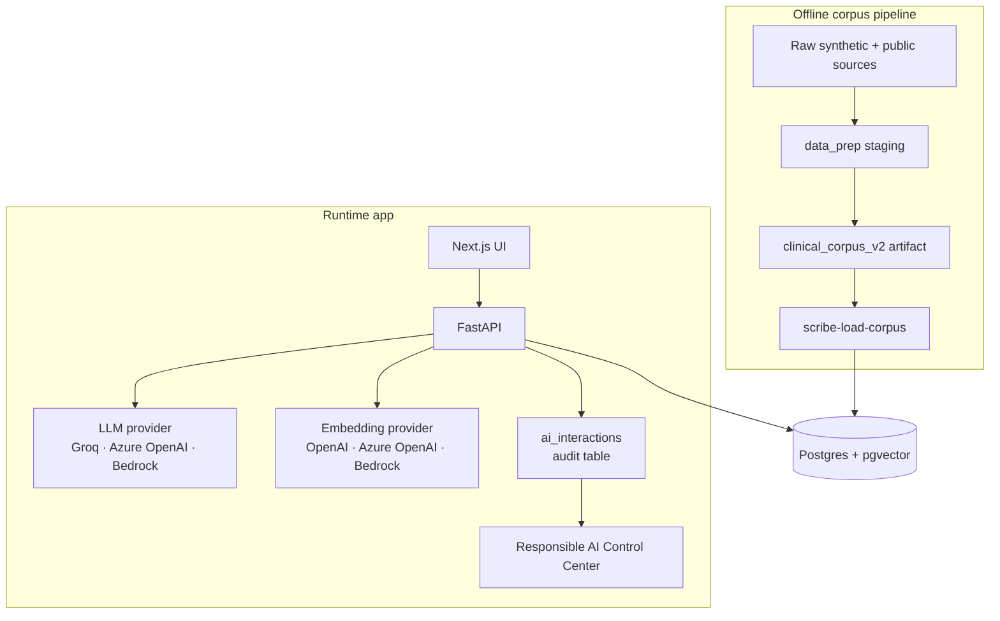

# Scribe IQ

[](https://github.com/sandeep-jay/scribe-iq/actions/workflows/ci.yml)
[](https://github.com/sandeep-jay/scribe-iq/blob/main/LICENSE)
[](https://sandeep-jay.github.io/scribe-iq/)

**[View source on GitHub ->](https://github.com/sandeep-jay/scribe-iq)**

**Governed clinical documentation AI prototype.** Synthetic longitudinal records, clinical-note-grounded RAG, chart review, structured note generation, and Responsible AI auditability — with provider-agnostic LLM and embedding layers and explicit production boundaries.

Clinical AI is only useful if it is grounded in the patient record, clear about its limits, and auditable when it influences human work. Scribe IQ is built around that premise.

Built on synthetic data. Not for clinical decision-making.

## Why this repo exists

Scribe IQ demonstrates how governed institutional data platform patterns translate into healthcare-shaped AI workflows. Built as an architecture review artifact for academic health, research, and education technology environments, it surfaces:

- longitudinal records and sensitive notes as the core data product
- offline corpus construction separated from runtime serving
- retrieval-grounded AI workflows with visible source context
- provider boundary awareness for LLMs and embeddings
- audit-first AI design with redacted previews and prompt/model traceability
- explicit production deltas for PHI, SSO/RBAC, tenancy, BAA-backed deployment, and observability

For role-fit interpretation across healthcare, university, research, and education-IT architecture reviews, see [Target role alignment](overview/TARGET_ROLE_ALIGNMENT.md).

---

## What this shows

| Layer | What is demonstrated |
|-------|----------------------|
| Corpus / data product | Nine-step offline `data_prep/` pipeline over Synthea and public clinical note sources; generated corpus artifact with manifest, dataset card, validation checks, and audit report |
| Serving substrate | FastAPI, Postgres/pgvector, Alembic migrations, async database access, and one governed store for patient rows, notes, embeddings, and audit records |
| Clinical workflows | Patient chart, encounter viewer, care timeline, pre-meeting prep, structured note generation, and grounded RAG chat |
| Responsible AI | Citation contract, append-only `ai_interactions`, redacted previews, prompt/model traceability, source traces, and Responsible AI Control Center |

---

## Corpus

Scribe IQ runs on a synthetic longitudinal patient and encounter dataset assembled from the following open sources — no real PHI is used:

- **[Synthea](https://github.com/synthetichealth/synthea)** — synthetic patient spine: demographics, encounters, conditions, medications, observations, and longitudinal structure.
- **[MTSamples](https://huggingface.co/datasets/harishnair04/mtsamples)** — public outpatient-style clinical note examples.
- **[MedSynth](https://huggingface.co/datasets/Ahmad0067/MedSynth)** — synthetic SOAP-style clinical notes and dialogue/note pairs.
- **[ACI-Bench](https://huggingface.co/datasets/mkieffer/ACI-Bench)** — encounter dialogue examples used in showcase workflows.

`data_prep/` matches public note examples to Synthea encounters, scores candidate fit, adapts notes for patient-level consistency, validates outputs, and emits `clinical_corpus_v2/` with a manifest, dataset card, and audit report.

Synthetic data only. No real PHI is used. The system is for demonstration and architecture review, not clinical decision-making.

---

## Architecture

`data_prep/` → `clinical_corpus_v2/` artifact → `scribe-load-corpus` → Postgres/pgvector → FastAPI → Next.js → `ai_interactions` audit table.



---

## Documentation

This page mirrors the repository README for the live documentation site.


| Visitor | Best entry point |
|---------|------------------|
| New here | [`docs/overview/REVIEWER_GUIDE.md`](overview/REVIEWER_GUIDE.md) |
| Product / architecture reviewer | [`docs/overview/PORTFOLIO_CASE_STUDY.md`](overview/PORTFOLIO_CASE_STUDY.md) |
| Role-fit reviewer | [`docs/overview/TARGET_ROLE_ALIGNMENT.md`](overview/TARGET_ROLE_ALIGNMENT.md) |
| Technical reviewer | [`docs/overview/SYSTEM_OVERVIEW.md`](overview/SYSTEM_OVERVIEW.md) |
| Data platform reviewer | [`docs/guides/CORPUS_ARTIFACTS.md`](guides/CORPUS_ARTIFACTS.md) |
| Local setup | [`docs/guides/QUICKSTART.md`](guides/QUICKSTART.md) |
| Full docs | [`docs/README.md`](https://github.com/sandeep-jay/scribe-iq/blob/main/docs/README.md) |

---

## Screenshots

The UI is backed by a synthetic Synthea cohort; on-screen labels make this explicit.

### Patient list


### Patient chart


### Pre-meeting summary


### Encounter viewer


### Responsible AI


---

## Stack

| Layer | Technology |
|-------|------------|
| Frontend | Next.js (App Router), TypeScript |
| Backend | FastAPI, asyncpg, Pydantic |
| Data store | Postgres 16 with pgvector |
| LLM | Groq, Azure OpenAI, or Amazon Bedrock |
| Embeddings | OpenAI, Azure OpenAI, or Amazon Bedrock |
| Migrations | Alembic |
| Corpus pipeline | Python, Synthea, MTSamples, MedSynth, ACI-Bench, Hugging Face datasets, Groq |

---

## Feature availability

Every external dependency is optional. The system degrades gracefully and reports what is configured via `GET /health`.

| Without any keys | LLM provider credentials | Embedding provider credentials + `--embed` | Admin flags |
|------------------|--------------------------|--------------------------------------------|-------------|
| Patient list, charts, encounter viewer | Pre-meeting summaries, structured note generation | RAG chat with citations | Responsible AI Control Center |

For the full flag matrix, see [`docs/overview/SYSTEM_OVERVIEW.md`](overview/SYSTEM_OVERVIEW.md#capability-flags).

## Getting started

Local run requires a generated or restored corpus artifact at `data/clinical_corpus_v2/`. This artifact is produced by the offline `data_prep/` pipeline and is not committed as application source. If the directory is empty after clone, see [`docs/guides/CORPUS_ARTIFACTS.md`](guides/CORPUS_ARTIFACTS.md). Full prerequisites, optional capability paths, and troubleshooting: [`docs/guides/QUICKSTART.md`](guides/QUICKSTART.md).

```bash
docker compose up -d
cd backend && python -m venv .venv && source .venv/bin/activate && pip install -e .
alembic upgrade head
scribe-load-corpus
uvicorn app.main:app --reload --host 127.0.0.1 --port 8000
# in a second terminal
cd frontend && nvm use && npm install && npm run dev
```

Frontend: <http://localhost:3000>. Backend: <http://127.0.0.1:8000/health>.

---

## Demo readiness

| Area | Status |
|------|--------|
| Synthetic clinical corpus pipeline | Implemented |
| Runtime app: charts, encounters, meeting prep, RAG chat, note generation | Implemented |
| Responsible AI audit surfaces | Implemented |
| PHI readiness | Intentionally not claimed |
| SSO / multi-tenant isolation | Deferred production seam |
| Hosted demo URL | Planned / optional |

---

## License

This project is source-available for portfolio review and educational purposes only.
Commercial use is prohibited without prior written permission. See [LICENSE](https://github.com/sandeep-jay/scribe-iq/blob/main/LICENSE).
