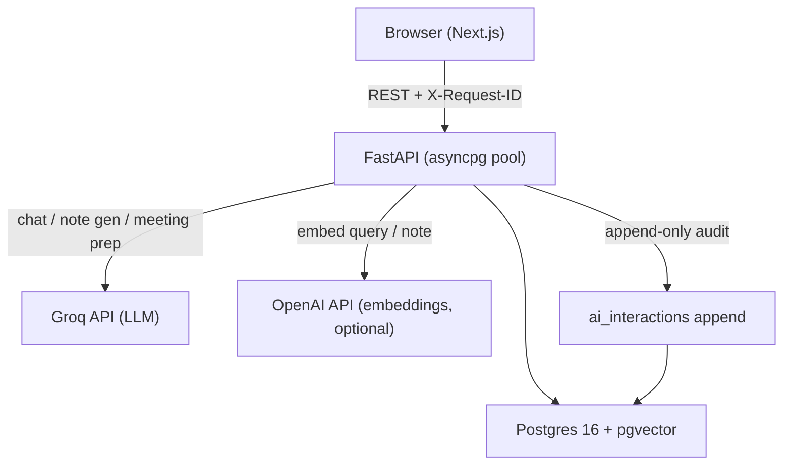
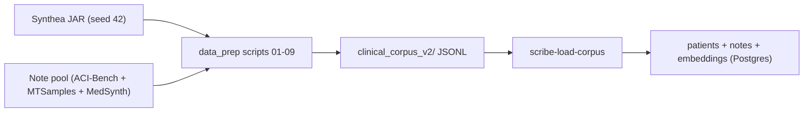

# System overview

Scribe IQ is a Next.js frontend over a FastAPI service, backed by Postgres with pgvector. When keys are configured, Groq supplies LLM completions and OpenAI supplies embeddings. Every AI-touching route can append an **audit row** to `ai_interactions` in the same Postgres database; **admin** routes and UI only control whether that data is exposed for inspection.

This document is the **architecture story**: diagrams, capability flags, extension seams. For rationale and alternatives considered, see [`DESIGN_NOTES.md`](./DESIGN_NOTES.md). For exact routes, schema, and flags, see [`docs/architecture/IMPLEMENTED_BASELINE.md`](../architecture/IMPLEMENTED_BASELINE.md).

---

## Runtime flow

The request path is intentionally short: the browser calls FastAPI, FastAPI queries Postgres directly, and only the three AI-touching routes (chat, note generation, meeting prep) reach external LLM/embedding services. Every request carries an `X-Request-ID` that propagates through structured logs, making user-visible actions traceable end-to-end without logging PHI in bodies.

---

## Corpus lifecycle

The corpus is built offline, not on demand. The application reads a stable, validated artifact; the data pipeline is a separate concern that can be re-run independently.

Synthea produces a deterministic synthetic patient population. The note pool contributes realistic clinical narrative from public datasets. The nine-step `data_prep` pipeline matches notes to synthetic patients, scores quality, selects a cohort, adapts notes via Groq for consistency, and emits validated JSONL with a dataset card and audit report. The backend loader (`scribe-load-corpus`) upserts that JSONL into Postgres; with `--embed`, it also generates OpenAI embeddings into the `notes.embedding` vector column.

For pipeline detail, see [`data_prep/README.md`](../../data_prep/README.md) and [`docs/reference/corpus_offline_pipeline_v2_brief.md`](../reference/corpus_offline_pipeline_v2_brief.md).

---

## Capability flags

Health (`GET /health`) reports which capabilities are configured; the UI surfaces degraded states instead of failing silently.

| Flag | What it unlocks | Default |
|------|-----------------|---------|
| `GROQ_API_KEY` | Pre-meeting summaries, structured note generation, chat completions | unset |
| `NOTE_GENERATION_ENABLED` | `POST /notes/generate` accepts writes | `false` |
| `MEETING_PREP_ENABLED` | `GET /patients/{id}/meeting-prep` produces Groq summaries | `true` |
| `OPENAI_API_KEY` + `scribe-load-corpus --embed` | RAG chat over note embeddings; chat returns 503 until embeddings exist | unset |
| `RESPONSIBLE_AI_ADMIN_ENABLED` (backend) | `/admin/responsible-ai/*` admin routes mounted | `false` |
| `NEXT_PUBLIC_SCRIBE_ADMIN_UI` (frontend) | Responsible AI Control Center nav and pages | `false` |
| `BACKEND_API_KEY` | API key gate on all non-public routes | unset |
| `CORS_RELAX_LOCAL` | Local/LAN demo CORS regex | `false` |

---

## Architecture themes (pointers)

These themes are intentional; **alternatives considered, depth, and production deltas** live in [`DESIGN_NOTES.md`](./DESIGN_NOTES.md).

- **Colocation:** vectors live in Postgres with relational rows; corpus is produced offline and loaded, not generated per request.
- **Grounding:** chat is retrieval-first with a citation-shaped prompt contract (`[note:uuid]`), not a post-hoc verifier loop.
- **Governance:** `ai_interactions` is a first-class table; recording is part of the AI request path (admin UI is optional exposure).

---

## Extension points

| Extension | Where it plugs in |
|-----------|-------------------|
| Alternative LLM provider | `app/llm.py` — `Settings.llm_provider` |
| Alternative embedding provider | `app/embeddings.py` — `Settings.embedding_provider` (`openai` / `azure` / `none`) |
| Agentic tool loop for chat | `app/api/chat.py` — single-shot today; tool calls can extend without changing audit shape |
| Production authentication | `OptionalApiKeyMiddleware` — replace with SSO/RBAC at the middleware layer |
| Audio transcription | [`docs/roadmap/SCRIBE_IQ_UI_ROADMAP.md`](../roadmap/SCRIBE_IQ_UI_ROADMAP.md) §12 — `POST /transcribe` before `POST /notes/generate` |
| Multi-tenant isolation | `domain` on `patients` / `notes` — row-level or pool work, not a new data model |

---

## Repository anchors

| Concern | Location |
|---------|----------|
| Local Postgres + pgvector | [`docker-compose.yml`](../../docker-compose.yml) (host port 5433) |
| Backend | [`backend/`](../../backend/) |
| Frontend | [`frontend/`](../../frontend/) |
| Corpus pipeline | [`data_prep/`](../../data_prep/) |
| Pre-built corpus | `data/clinical_corpus_v2/` |
| As-built API and schema | [`docs/architecture/IMPLEMENTED_BASELINE.md`](../architecture/IMPLEMENTED_BASELINE.md) |
| Run instructions | [`docs/guides/QUICKSTART.md`](../guides/QUICKSTART.md) |
| Product framing | [`docs/overview/PRODUCT_CONTEXT.md`](./PRODUCT_CONTEXT.md) |
| Design rationale | [`docs/overview/DESIGN_NOTES.md`](./DESIGN_NOTES.md) |
