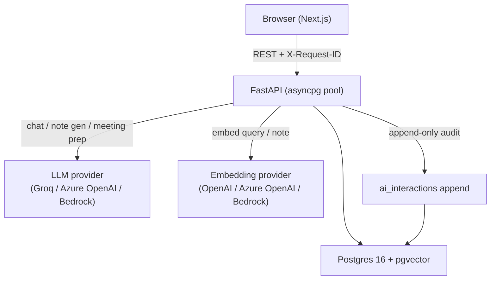
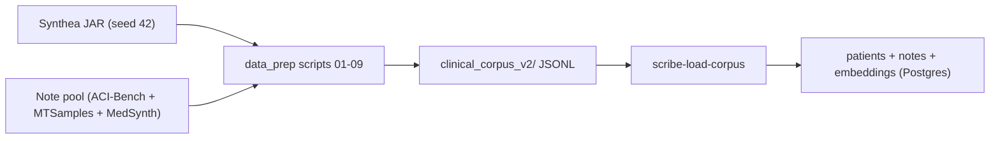

# System overview

Scribe IQ is a governed clinical documentation AI prototype that turns an offline synthetic clinical corpus into a clinical product surface with auditability built in from the schema up: Postgres/pgvector serving, FastAPI APIs, provider-agnostic LLM workflows, a Next.js clinical UI, and Responsible AI review. LLM and embedding providers are **configurable per deployment**: the demo defaults to Groq for completions and OpenAI for embeddings, but the same code paths run against Azure OpenAI or Amazon Bedrock for institutional postures. AI interaction audit is modeled as first-class Postgres data in `ai_interactions`; **admin** routes and UI only control whether those rows are exposed for inspection.

This document is the **architecture story**: diagrams, capability flags, extension seams. For rationale and alternatives considered, see [`DESIGN_NOTES.md`](./DESIGN_NOTES.md). For exact routes, schema, and flags, see [`docs/architecture/IMPLEMENTED_BASELINE.md`](../architecture/IMPLEMENTED_BASELINE.md). For the provider configuration matrix, see [`docs/guides/LLM_AND_EMBEDDING_PROVIDERS.md`](../guides/LLM_AND_EMBEDDING_PROVIDERS.md).

---

## Runtime flow

The request path is intentionally short: the browser calls FastAPI, FastAPI queries Postgres directly, and only the AI-touching routes (chat, note generation, meeting prep) reach external LLM/embedding services. Every request carries an `X-Request-ID` that propagates through structured logs, making user-visible actions traceable end-to-end without logging PHI in bodies.

---

## Corpus lifecycle

The corpus is built offline, not on demand. The application reads a stable, validated artifact; the data pipeline is a separate concern that can be re-run independently.

Synthea produces a deterministic synthetic patient population. The note pool contributes realistic clinical narrative from public datasets. The nine-step `data_prep` pipeline matches notes to synthetic patients, scores quality, selects a cohort, adapts notes via the configured LLM provider for consistency, and emits validated JSONL with a dataset card and audit report. The backend loader (`scribe-load-corpus`) upserts that JSONL into Postgres; with `--embed`, it generates embeddings via the **configured embedding provider** (OpenAI, Azure OpenAI, or Amazon Bedrock — see [`docs/guides/LLM_AND_EMBEDDING_PROVIDERS.md`](../guides/LLM_AND_EMBEDDING_PROVIDERS.md)) into the `notes.embedding` vector column.

For pipeline detail, see [`data_prep/README.md`](../../data_prep/README.md) and [`docs/reference/corpus_offline_pipeline_v2_brief.md`](../reference/corpus_offline_pipeline_v2_brief.md).

---

## Capability flags

Health (`GET /health`) reports which capabilities are configured; the UI surfaces degraded states instead of failing silently.

| Flag | What it unlocks | Default |
|------|-----------------|---------|
| `LLM_PROVIDER` | Selects LLM provider (`groq`, `azure_openai`, `bedrock`) for chat, pre-meeting summaries, and note generation | `groq` |
| `GROQ_API_KEY` | Groq completions when `LLM_PROVIDER=groq` | unset |
| `AZURE_OPENAI_API_KEY` + `AZURE_OPENAI_ENDPOINT` + `AZURE_OPENAI_CHAT_DEPLOYMENT` | Azure OpenAI completions when `LLM_PROVIDER=azure_openai` | unset |
| `AWS_REGION` + `AWS_BEDROCK_CHAT_MODEL_ID` (+ AWS credentials or role/profile) | Bedrock completions when `LLM_PROVIDER=bedrock` | unset |
| `EMBEDDING_PROVIDER` + provider credentials + `scribe-load-corpus --embed` | RAG chat over note embeddings; chat returns 503 until embeddings exist | `openai` (unset credentials) |
| `NOTE_GENERATION_ENABLED` | `POST /notes/generate` accepts writes | `false` |
| `MEETING_PREP_ENABLED` | `GET /patients/{id}/meeting-prep` produces LLM summaries | `true` |
| `RESPONSIBLE_AI_ADMIN_ENABLED` (backend) | `/admin/responsible-ai/*` admin routes mounted | `false` |
| `NEXT_PUBLIC_SCRIBE_ADMIN_UI` (frontend) | Responsible AI Control Center nav and pages | `false` |
| `BACKEND_API_KEY` | API key gate on all non-public routes | unset |
| `CORS_RELAX_LOCAL` | Local/LAN demo CORS regex | `false` |

---

## Provider boundary

The LLM and embedding providers are the **only** external network boundaries on the AI request path. Everything else — patient data, notes, encounter context, audit rows — stays inside the Postgres instance for the duration of a request.

- **What leaves the deployment:** the selected prompt context (system instructions, retrieved note excerpts, user messages, transcripts) is sent to the configured LLM provider; the query and note text required for embeddings is sent to the configured embedding provider.
- **What does not leave:** identifiers, raw chart rows, audit table contents, structured codes, request bodies. The provider sees only what the route handler explicitly serializes into the prompt or embedding payload.
- **Per-deployment, not per-request:** `LLM_PROVIDER` and `EMBEDDING_PROVIDER` are settings, not knobs that change at runtime. Switching providers in production would be a deployment-level decision with an embedding rebuild step where applicable.

For the full provider matrix, environment variables, and rebuild workflow, see [`docs/guides/LLM_AND_EMBEDDING_PROVIDERS.md`](../guides/LLM_AND_EMBEDDING_PROVIDERS.md). For PHI posture and the explicit caveat that enterprise providers do not by themselves create compliance, see [`PRIVACY_AND_PROVIDER_BOUNDARIES.md`](./PRIVACY_AND_PROVIDER_BOUNDARIES.md).

---

## Architecture themes (pointers)

These themes are intentional; **alternatives considered, depth, and production deltas** live in [`DESIGN_NOTES.md`](./DESIGN_NOTES.md).

- **Colocation:** vectors live in Postgres with relational rows; corpus is produced offline and loaded, not generated per request.
- **Grounding:** chat is retrieval-first with a citation-shaped prompt contract (`[note:uuid]`), not a post-hoc verifier loop.
- **Governance:** `ai_interactions` is a first-class table for completed and handled degraded AI paths; admin UI is optional exposure.

---

## Extension points

| Extension | Where it plugs in |
|-----------|-------------------|
| Alternative LLM provider | `app/llm/` — `Settings.llm_provider` |
| Alternative embedding provider | `app/embeddings/` — `Settings.embedding_provider` (`openai` / `azure_openai` / `bedrock` / `none`) |
| Agentic tool loop for chat | `app/api/chat.py` — single-shot today; tool calls can extend without changing audit shape |
| Production authentication | `OptionalApiKeyMiddleware` — replace with SSO/RBAC at the middleware layer |
| Audio transcription | [`docs/roadmap/SCRIBE_IQ_UI_ROADMAP.md`](../roadmap/SCRIBE_IQ_UI_ROADMAP.md) §12 — `POST /transcribe` before `POST /notes/generate` |
| Multi-tenant isolation | `domain` on `patients` / `notes` — row-level or pool work, not a new data model |

---

## Repository anchors

| Concern | Location |
|---------|----------|
| Local Postgres + pgvector | [`docker-compose.yml`](../../docker-compose.yml) (host port 5433) |
| Backend | [`backend/`](../../backend/) |
| Frontend | [`frontend/`](../../frontend/) |
| Corpus pipeline | [`data_prep/`](../../data_prep/) |
| Generated corpus artifact | `data/clinical_corpus_v2/` |
| As-built API and schema | [`docs/architecture/IMPLEMENTED_BASELINE.md`](../architecture/IMPLEMENTED_BASELINE.md) |
| Run instructions | [`docs/guides/QUICKSTART.md`](../guides/QUICKSTART.md) |
| Provider configuration | [`docs/guides/LLM_AND_EMBEDDING_PROVIDERS.md`](../guides/LLM_AND_EMBEDDING_PROVIDERS.md) |
| Product framing | [`docs/overview/PRODUCT_CONTEXT.md`](./PRODUCT_CONTEXT.md) |
| Design rationale | [`docs/overview/DESIGN_NOTES.md`](./DESIGN_NOTES.md) |
