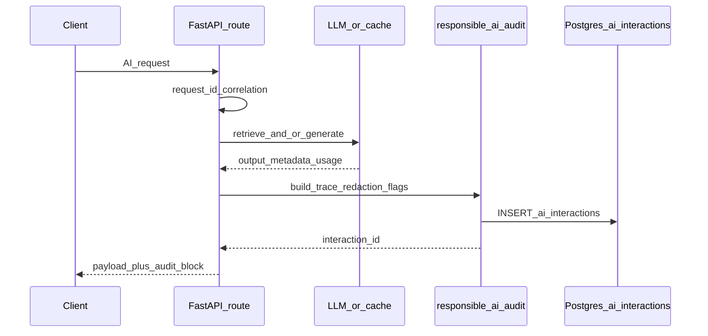

# Scribe IQ — Responsible AI Control Center (roadmap)

This document is the **product + engineering plan** for the **Responsible AI Control Center**: unified audit logging, admin APIs, and admin UI so every AI outcome is **traceable**, **source-grounded**, **safety-checked**, and **auditable**. It complements **`docs/README.md`** (documentation index), **`docs/roadmap/SCRIBE_IQ_UI_ROADMAP.md`** (general UI phases), **`docs/architecture/IMPLEMENTED_BASELINE.md`** (what exists today), and **`docs/roadmap/PHASE1_MASTER_PLAN.md`** / **`docs/roadmap/SCRIBE_IQ_V1_IMPLEMENTATION_PLAN.md`** where relevant.

**Status:** **implemented** in the repository (see **`docs/architecture/IMPLEMENTED_BASELINE.md`** for routes, env flags, and schema). Remaining roadmap items (for example a formal review queue table) may still be future work.

**Last updated:** 2026-05-05

### Implementation snapshot (2026-05)

- **Database:** Alembic **`20260505_003`** — table **`ai_interactions`**.
- **Backend package:** `backend/app/responsible_ai/` (audit, redaction, hashes, prompt registry, safety checks, source trace); **`POST /chat`**, **`GET …/meeting-prep`**, **`POST /notes/generate`** record interactions and return **`audit` / `ai_audit`** metadata where applicable.
- **Admin API:** `GET /admin/responsible-ai/metrics`, `…/interactions`, `…/interactions/{id}`, `…/safety-flags`, `…/model-usage` when **`RESPONSIBLE_AI_ADMIN_ENABLED=true`**.
- **Frontend:** `NEXT_PUBLIC_SCRIBE_ADMIN_UI` enables nav + **`/admin/responsible-ai`** pages and “Why this…?” links.
- **Operational note:** JSONB columns for audit inserts use serialized JSON for **`asyncpg`** compatibility.

---

## 1. Goals

- Prove **traceability, source-grounding, safety signals, and auditability** for every AI workflow already in the app (`backend/app/api/chat.py`, meeting prep in `backend/app/api/patients.py`, `backend/app/api/note_generate.py`).
- Keep **PHI out of raw audit fields**: store hashes plus **redacted previews** only (full transcript/message bodies never persisted by default).

---

## 2. Architecture (data flow)

---

## 3. Locked design decisions

| Topic | Decision |
|--------|----------|
| **Correlation id** | Prefer `X-Request-ID` from the client when present; otherwise generate a UUID per inbound HTTP request and thread it through audit rows (`request_id` TEXT). |
| **Interaction status** | `success` \| `degraded` \| `blocked` \| `failed`. Map today's behaviors: meeting prep `deterministic-fallback` / `degraded=True` → **degraded**; chat 503/404/502 paths → **failed** (and optionally log a row with `error_message` where the handler exits early); optional future guardrails → **blocked**. |
| **Failure logging** | For early HTTP exits (for example chat 503 no embeddings), either skip DB insert (simpler) or insert **failed** with minimal fields — pick one for Phase 1 consistency. Recommendation: log failures for `/chat` and `/notes/generate` only when patient/domain context exists, to avoid noise. |
| **Cached meeting prep** | Always append an `ai_interactions` row on cache hit: `cached=true` in `governance_json`, `latency_ms` small, tokens null, still attach `patient_id`, `source_fingerprint`, `prompt_version`. |
| **Admin auth** | Reuse existing `OptionalApiKeyMiddleware`: when `BACKEND_API_KEY` is set, admin routes require the same key. Add **`RESPONSIBLE_AI_ADMIN_ENABLED`** (or similar) in `Settings` so `/admin/responsible-ai/*` APIs return **404** when disabled (enable explicitly on demo machines). |
| **Frontend exposure** | Gate admin navigation and pages with **`NEXT_PUBLIC_SCRIBE_ADMIN_UI=true`** (default: env flag). |
| **Token fields** | Extend `backend/app/llm.py` so Groq calls return **usage** plus model id when the API provides them; store `input_tokens` / `output_tokens` when available, else null. |
| **Meeting prep sources** | Extend `meeting_prep_service.py` `note_rows` query to include **`notes.id` AS note_id** and pass through each visit dict so `retrieved_sources_json` can list real UUIDs (required for the Sources tab). |

---

## 4. Data layer

**New migration (Alembic):** create `ai_interactions` (UUID PK, `request_id`, `interaction_type`, nullable `patient_id` / `note_id`, provider/model, prompt and hash fields, redacted previews, JSONB blobs, latency/tokens, status, timestamps, indexes). Store **canonical UUID string** for `patient_id` after `resolve_patient_id` when known.

**Phase 3 add-on (review queue):** small table `ai_interaction_reviews` (`interaction_id` FK, `flag_code`, `severity`, `status` open/reviewed, `reviewer`, `note`, timestamps), or embed review fields in `governance_json` for demo-only. Prefer a **real table** if "Mark reviewed" must survive reloads.

---

## 5. Backend package layout

Create `backend/app/responsible_ai/`:

| Module | Role |
|--------|------|
| **`audit_logger.py`** | Single async `record_interaction(conn, ...)` → INSERT + return UUID; shared by all routes. |
| **`redaction.py`** | Deterministic PHI-ish minimization for previews (names, email, phone, MRN-like patterns, optional dates). |
| **`hashes.py`** | SHA-256 helpers for system prompt, inputs, outputs. |
| **`prompt_registry.py`** | Dict keyed by `chat_rag_v1`, `meeting_prep_v1` (map `scribe-meeting-prep-1`), `note_generation_v1`; drives governance flags in JSON. |
| **`safety_checks.py`** | Pure functions: no citations (chat), low citation coverage, empty output, hedging heuristics, PHI leakage in output preview, stale source. |
| **`source_trace.py`** | Normalize chat citations plus meeting prep note list into `retrieved_sources_json` / `citations_json`. |
| **`metrics.py`** | SQL helpers for admin aggregates (optional separation from routes). |

**Prompt version constants**

- **Chat:** introduce `CHAT_RAG_PROMPT_VERSION` in `chat.py` (or registry); system prompt is inline today — version plus hash covers drift.
- **Notes:** hash `NOTE_GEN_SYSTEM_PROMPT` in `note_generate.py` plus explicit `note_generation_v1` string in responses.
- **Meeting prep:** keep `MEETING_PREP_PROMPT_VERSION` in `meeting_prep_service.py` as source of truth; registry documents semantics.

---

## 6. Route integrations

1. **`POST /chat`** (`api/chat.py`) — After a successful answer: record retrieval rows → `citations_json` / `retrieved_sources_json`, compute safety flags, redact previews of user message and answer, insert row, extend `ChatResponse` with optional `audit` (interaction id, model, prompt version, source count, safety status, latency). Map `model_provider` from `Settings.llm_provider`.

2. **`GET /patients/{id}/meeting-prep`** (`api/patients.py`) — On cache hit and on fresh generation: both call `record_interaction`. Include `source_fingerprint`, `cached`, `degraded`, note ids from enriched bundle. Extend `MeetingPrepResponse` with nested `ai_audit`.

3. **`POST /notes/generate`** (`api/note_generate.py`) — After successful LLM plus DB write: `note_id`, `patient_id`, human-review flags from registry, safety heuristics on structured output. Extend `GenerateNoteResponse` with optional `audit`.

---

## 7. Admin API

New router (for example `backend/app/api/admin_responsible_ai.py`), mounted in `main.py` **only when** `RESPONSIBLE_AI_ADMIN_ENABLED` is true.

**Read-only first**

- `GET /admin/responsible-ai/metrics` — summary, by_type, by_status, daily `time_series`.
- `GET /admin/responsible-ai/interactions` — filters: date range, type, status, model, prompt_version, patient search, safety flag presence.
- `GET /admin/responsible-ai/interactions/{id}` — full row for detail UI.
- `GET /admin/responsible-ai/safety-flags` — aggregate counts by flag code.
- `GET /admin/responsible-ai/model-usage` — group by provider/model.

**Phase 3:** `PATCH` (or similar) for review queue if the reviews table exists.

---

## 8. Frontend (Next.js App Router)

**UI and visuals are in scope**, not API-only. Aim for a governed-clinical look: calm layouts, readable tables, status semantics, minimal flashy styling. Reuse existing patterns (`AppShell`, typography, spacing, light/dark).

| Route | Purpose |
|--------|---------|
| `/admin/responsible-ai` | **Control Center:** hero plus subtitle; filter bar; KPI cards; charts (usage over time, status breakdown, safety by category, model plus prompt usage); interaction log with **View** → detail. |
| `/admin/responsible-ai/[interactionId]` | **Detail:** header; metadata; tabs — Traceability, Redacted previews, Safety checks, Sources, Raw metadata. |
| `/admin/responsible-ai/governance` | Prompt registry plus model usage plus prompt detail (Phase 3 acceptable). |
| `/admin/responsible-ai/review-queue` | Flagged queue plus actions (Phase 3; stubs acceptable initially). |

### Visual and UX conventions

- Copy: traceable, source-grounded, human review required, PHI minimized, prompt versioned.
- **Status badges:** Pass / Warning / Blocked / Failed (and degraded where relevant), consistent in light/dark.
- **Charts:** Recharts or lightweight SVG/CSS; time-series from `metrics.time_series`.
- **Components** (for example `frontend/src/components/responsible-ai/`): filters, KPI cards, charts, interaction table, detail subcomponents.

### Product flows

- Meeting prep, Chat, Generate note: subtle **"Why this output?"** linking to `/admin/responsible-ai/{interactionId}` (Phase 2).

**Client:** extend `frontend/src/lib/backend.ts` with typed admin helpers; reuse `authHeaders()`.

**Shell:** optional sidebar link in `frontend/src/components/AppShell.tsx` when the admin UI env flag is on.

---

## 9. KPI definitions (implement literally)

- **Citation coverage:** among interactions where `interaction_type in ('chat','meeting_prep')`, fraction with non-empty `citations_json` or non-empty `retrieved_sources_json` (document edge cases for cache-only prep).
- **Human review required:** count rows where the registry marks note generation as requiring review, or `safety_flags_json` contains `human_review_recommended`.

---

## 10. Phased delivery

| Phase | Scope |
|-------|--------|
| **1 — Must ship for demo credibility** | `ai_interactions` table; audit logger; integrate `/chat`, `/meeting-prep`, `/notes/generate`; admin metrics + list + detail API; Control Center page (layout, KPIs, interaction table, detail tabs; charts may be placeholders). |
| **2 — Strong demo polish** | Safety flags surfaced end-to-end; redacted previews; source trace tab content; full charts; **Why this output?** links from chart, chat, and note flows. |
| **3 — Wow factor** | Governance page; review queue with persistence; model/prompt usage charts; export audit JSON. |

---

## 11. Testing and verification

- Minimum manual path: call the three AI endpoints, confirm a row exists, confirm admin GET returns it.
- Run `alembic upgrade head` against local Compose Postgres after migration lands.

---

## 12. Risks (non-blocking)

- **Unsupported clinical claim** in safety checks: treat as **heuristic / experimental** unless a second LLM pass is added.
- **Azure path:** when Azure OpenAI is fully wired, align `model_provider` and model name with settings everywhere.

---

## 13. Implementation checklist (engineering)

**Phase 1 (shipped):** The core audit trail + admin APIs + gated Next.js admin surfaces described earlier are implemented—inventory and pointers live in **`docs/architecture/IMPLEMENTED_BASELINE.md`** (Responsible AI section).

What landed (high level):

- Alembic migration creating **`ai_interactions`** (plus indexes as shipped).
- **`backend/app/responsible_ai/`** package wiring audit inserts + governance metadata on **`POST /chat`**, **`GET …/meeting-prep`**, **`POST /notes/generate`** with **`audit` / `ai_audit`** payloads where applicable.
- **`backend/app/api/admin_responsible_ai.py`** routes gated by **`RESPONSIBLE_AI_ADMIN_ENABLED`**.
- Frontend **`/admin/responsible-ai`** experience gated by **`NEXT_PUBLIC_SCRIBE_ADMIN_UI`** (shell entry + pages).

**Open / Phase 2–3 backlog (still roadmap):**

- Formal **`ai_interaction_reviews`** (or equivalent persistence) if “review queue” must survive reloads beyond governance JSON experiments.
- Optional **`PATCH`** / reviewer flows on admin APIs if product wants operational queues.
- Phase 3 polish called out in §10 (export audit JSON, richer governance page)—confirm against baseline gaps before promising dates.

---

## 14. Related documents

| Document | Role |
|----------|------|
| `docs/README.md` | Documentation index (roadmaps, references, archives) |
| `docs/architecture/IMPLEMENTED_BASELINE.md` | What is implemented today |
| `docs/roadmap/SCRIBE_IQ_UI_ROADMAP.md` | Overall UI roadmap |
| `docs/roadmap/PHASE1_MASTER_PLAN.md` | Phase-1 master plan |
| `docs/roadmap/SCRIBE_IQ_V1_IMPLEMENTATION_PLAN.md` | V1 implementation plan |
